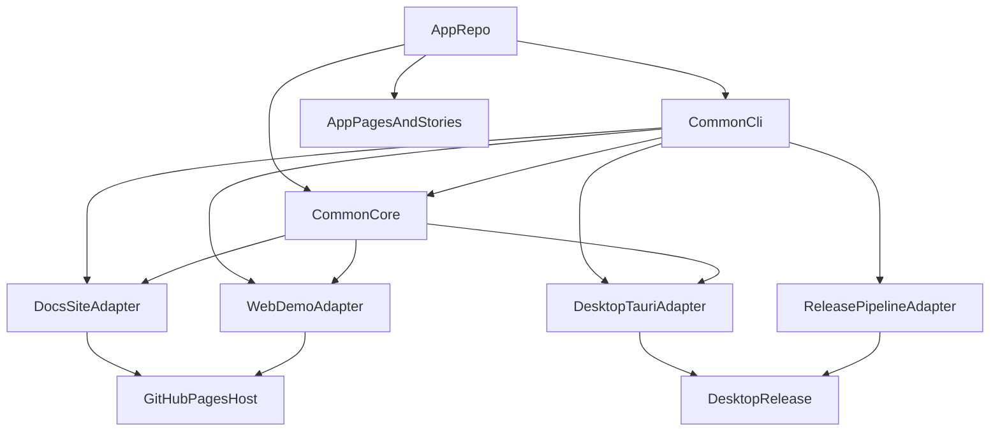

# RustWebAppCommon 统一边界与架构建议
> 更新时间: 2026-04-01

## 执行摘要
基于当前样本，推荐把 `RustWebAppCommon` 建成“三层结构”而不是单体框架：
- `common_core`: 统一配置、CLI 协议、路由描述、文档索引模型、主题 token、release metadata。
- `common_adapters`: 面向不同承载面的适配层，例如 `web_demo_adapter`、`desktop_tauri_adapter`、`docs_site_adapter`、`release_pipeline_adapter`。
- `app_owned`: 页面内容、业务路由、业务数据、demo story、具体 UI 组件与环境配置。

这样既能统一多个仓库的底座能力，又不会把所有应用绑死在一个 UI runtime 或一个托管方案上。

## 推荐结论
### adopt_now
- 统一 `common_core / common_adapters / app_owned` 的分层模型。
- 统一 CLI 术语与命令面，例如 `dev`、`demo`、`release`、`docs`。
- 统一 docs/index/AGENTS 入口和风格 token。
- 统一 GitHub Pages 的静态发布 contract：`/docs`、`index.html` 顶层入口、必要时 `404.html` fallback。

### adapt_before_adopt
- Dioxus 风格的 `base_path`、nested routes 和静态打包语义。
- Tauri 的 updater、签名与 GitHub release pipeline。
- Trunk 的静态 web build 语义，例如 `dist/` 和 `public_url`。

### keep_in_app
- 页面具体内容、业务逻辑、业务数据源、业务路由树。
- demo 的故事脚本、页面文案、展示素材。
- 是否采用 Dioxus、Tauri 或其他前端/runtime 方案的最终实现细节。

### postpone
- starter repo 的最终技术栈钉死。
- `Enva` 约束复核前的实现级决定。
- `doc_auto` 的真实落点与自动同步机制。

## 分层建议


## 能力归属表
| 能力 | 建议归属 | 原因 |
|---|---|---|
| 配置模型（app id、repo 名、base path、surface） | `common_core` | 所有应用都会共享，且不依赖具体页面内容 |
| CLI 协议（`dev/build/demo/release/docs`） | `common_core` | 需要统一命名与参数语义 |
| `host` / `port` 参数协议 | `common_core` | 需要统一传参与本地启动体验 |
| 路由描述模型 | `common_core` | 需要统一“主页面 / 子页面 / demo 页面”的抽象 |
| GitHub Pages 发布约束 | `common_adapters` | host 规则稳定，但实现依赖具体静态产物 |
| Tauri updater / signing / release pipeline | `common_adapters` | 能力强但平台特定，不能强制所有仓库采用 |
| 静态 web build 约束 | `common_adapters` | `public_url`、`dist`、`404.html` 等和 host 强关联 |
| README / index / AGENTS 结构 | `common_core` | 属于统一文档治理层 |
| Nier 风格 token | `common_core` | 适合统一词汇和视觉语法 |
| 页面组件实现 | `app_owned` | 与业务内容和页面结构强耦合 |
| 业务路由和内容 | `app_owned` | 不应进入公共层 |
| demo story / showcase 文案 | `app_owned` | 各应用展示重点不同 |

## 统一 CLI 建议
推荐只统一“命令协议”，不统一所有底层工具：

| 命令 | 作用 | 典型底层实现 |
|---|---|---|
| `common dev --surface web --host H --port P` | 本地启动 web/demo | Dioxus / Trunk / 其他 web adapter |
| `common dev --surface desktop` | 本地启动桌面壳层 | Tauri adapter |
| `common demo build` | 生成静态 demo/storyboard 产物 | web adapter + docs adapter |
| `common release desktop` | 打桌面包并准备 release | Tauri + release pipeline adapter |
| `common docs build` | 构建 README/index/docs 站点 | docs adapter |

## 推荐目录模型
```text
common/
  core/
    config/
    route_schema/
    docs_schema/
    theme_tokens/
    release_metadata/
  adapters/
    web_demo/
    desktop_tauri/
    docs_site/
    release_pipeline/
  cli/
    commands/
apps/
  app_a/
  app_b/
docs/
  index.md
  architecture/
  guides/
examples/
demo/
```

## Failure Modes
- **过度集中化**: 把页面组件、业务路由和 demo 文案放进 common，会导致所有应用被公共层反向绑定。
- **把 adapter 当 core**: 若直接把 Tauri 或 Dioxus 写成唯一实现，未来迁移成本会明显上升。
- **host 约束外泄**: 若将 GitHub Pages 的 `404.html`、`/docs` 等约束写入 core，后续迁移 host 会受阻。
- **文档入口漂移**: 如果没有 `README + AGENTS + docs/index` 的固定边界，agent 入口会越来越碎片化。

## 迁移成本判断
- `common_core`: `medium`，需要统一术语、配置和文档入口，但收益最大。
- `common_adapters`: `medium-high`，因为不同 runtime/host 差异较大。
- `app_owned` 保持在应用层: `low`，这是降低系统复杂度的关键策略。

## 需要后续 `Enva` 复核的点
- `common_core` 的目录结构是否能与现有本地项目约束兼容。
- CLI 协议是否需要兼容已有命令别名或已有启动脚本。
- docs/index 入口是否要兼容本地已有文档布局。

## 最终建议
对 `RustWebAppCommon`，最稳妥的路径不是“找一个框架一统天下”，而是：
1. 先统一 `core` 的协议、文档入口和主题 token。
2. 再把 web、desktop、release、docs 做成 adapter。
3. 最后让各应用在 `app_owned` 层自由持有页面与故事内容。
