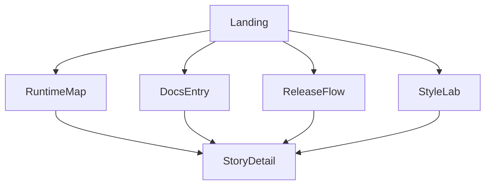

# Rust Web Common Demo Storyboard
> 更新时间: 2026-04-01

## 目标
本 storyboard 不是实现稿，而是用于定义未来 demo 应展示什么、如何导航、如何与 `common` 边界保持一致。它同时服务于两种展示面：
- 本地运行 demo
- GitHub Pages 上的静态展示版

## 展示目标
1. 让用户在 1 分钟内理解 `RustWebAppCommon` 解决的问题。
2. 展示 `common_core / common_adapters / app_owned` 的边界，而不是直接展示底层代码。
3. 让 agent 能通过 demo 页面直接跳到 docs/index、architecture、theme 和 examples 入口。
4. 在静态托管条件下也能保留清晰的页面层级和子页面跳转。

## 页面地图

## 页面清单
### 1. Landing
- **目标**: 说明“为什么需要 common”。
- **内容区块**:
  - 顶部一句话价值主张
  - 四个核心能力卡片：构建、发布、文档、demo
  - 一个“边界图”入口，直接跳转到 `RuntimeMap`
  - 一个“为 agent 准备”入口，直接跳转到 `DocsEntry`
- **风格提示**:
  - 大标题 + 细边框卡片
  - 高对比编号标签，例如 `01 / Common Surface`

### 2. RuntimeMap
- **目标**: 展示 `common_core / common_adapters / app_owned`。
- **内容区块**:
  - 分层结构图
  - 能力归属表
  - “为什么不把页面和业务内容放进 common”说明
- **交互建议**:
  - 点击某个能力块时，展示其属于 `core`、`adapter` 还是 `app`

### 3. DocsEntry
- **目标**: 演示 `README + AGENTS + docs/index + examples/README` 的入口体系。
- **内容区块**:
  - 主 agent 入口包
  - subagent 入口包
  - docs/index 导航样例
- **交互建议**:
  - 按“角色”切换视图，例如 `human` / `main-agent` / `subagent`

### 4. ReleaseFlow
- **目标**: 说明静态 demo、GitHub Pages 与桌面 release 的关系。
- **内容区块**:
  - GitHub Pages 路径：`/docs`、`index.html`、`404.html`
  - Desktop 路径：Tauri build / bundle / updater / release
  - “为什么在线 demo 与桌面更新要分层”说明
- **交互建议**:
  - 使用左右两栏对照 `static demo` 与 `desktop release`

### 5. StyleLab
- **目标**: 展示 Nier 黑白灰 token 如何影响 docs 与 demo。
- **内容区块**:
  - palette token
  - typography token
  - markdown 组件映射
  - 页面组件示意块
- **交互建议**:
  - 按 token 分类切换：`color` / `type` / `blocks`

### 6. StoryDetail
- **目标**: 为任意页面提供“进一步阅读”与“下一步任务”。
- **内容区块**:
  - 引用关联文档
  - 当前页面对应的 common 边界
  - 下一步设计或实现入口

## 本地运行与在线展示映射
| 场景 | 推荐入口 | 说明 |
|---|---|---|
| 本地调试 | `common dev --surface web --host <host> --port <port>` | 提供可交互 demo，验证页面层级与路由 |
| 静态展示 | GitHub Pages `/docs` 或 Actions artifact | 提供 storyboard、文档入口和静态页面演示 |
| 桌面展示 | `common dev --surface desktop` 或独立 release 包 | 只展示 optional desktop adapter，不把桌面壳层当成唯一入口 |

## 路由建议
- `/`：Landing
- `/runtime`：RuntimeMap
- `/docs-entry`：DocsEntry
- `/release-flow`：ReleaseFlow
- `/style-lab`：StyleLab
- `/detail/:topic`：StoryDetail

如果最终托管在 GitHub Pages：
- 需要保证静态产物顶层存在 `index.html`
- 对 client-side routing 需要准备 `404.html` fallback
- 所有静态资源路径必须尊重 `base_path` 或 `public_url`

## 不应放入 demo 的内容
- 实际业务后端逻辑
- 私有环境配置
- 复杂更新服务实现细节
- `Enva` 相关本地细节

## 与 `common` 边界的一致性
- demo 只展示 `common` 提供的能力界面，不展示各应用私有实现细节。
- 页面内容可以举例，但不能让用户误以为 common 直接拥有业务页面。
- 风格系统由 common 提供 token 与语法，具体页面内容仍然由应用层决定。

## 验收标准
- 读完 Landing 和 RuntimeMap 后，用户应能回答“什么放 common、什么留 app”。
- 读完 DocsEntry 后，agent 应知道最小读取入口。
- 读完 ReleaseFlow 后，用户应知道为什么 GitHub Pages 和桌面 release 不能混成一个层。
- 读完 StyleLab 后，设计与实现 agent 都应能引用同一套黑白灰 token。
