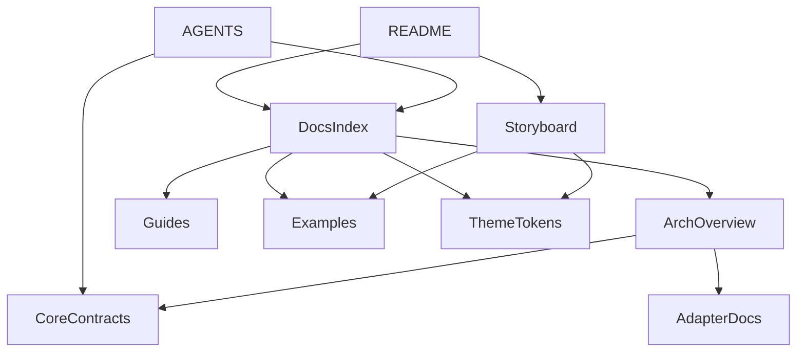

# RustWebAppCommon 文档入口与 demo 信息架构设计
> 更新时间: 2026-04-01

## 目标
本文件把文档入口、agent 入口、demo 页面结构和 Nier 风格 token 整合成同一套信息架构，确保：
- `common_core` 的术语能够直接映射到 docs 与 demo。
- 主 agent、subagent、普通读者各自都有低上下文入口。
- docs 与 demo 不会演化成两套互不兼容的叙事系统。

## 信息架构原则
- **入口分工固定**: README、AGENTS、docs/index、examples、demo 各有明确职责。
- **一套术语，多种视图**: docs 与 demo 共用 `common_core / common_adapters / app_owned`、CLI vocabulary、theme token 等术语。
- **页面是解释层，不是实现层**: 页面只解释能力与关系，不承载业务实现细节。
- **路由服务内容层级**: 页面路径要能反映“概览 → 结构 → 流程 → 风格 → 细节”的阅读路径。

## 顶层目录建议
```text
README.md
AGENTS.md
docs/
  index.md
  architecture/
    overview.md
    core-contracts.md
    adapters.md
  guides/
    dev.md
    release.md
  theme/
    nier_gray_tokens.md
examples/
  README.md
demo/
  storyboard.md
  pages/
```

## 入口职责表
| 入口 | 面向对象 | 只回答什么 | 不应承担什么 |
|---|---|---|---|
| `README.md` | 初次进入的人与 agent | 项目是什么、为什么存在、去哪里继续读 | 细节设计、完整 API、长篇背景 |
| `AGENTS.md` | 主 agent / subagent | 先读路径、边界、禁止假设、受保护目录 | 面向终端用户的叙事 |
| `docs/index.md` | 系统化阅读者 | 结构总览、章节导航、入口索引 | 过深实现细节 |
| `examples/README.md` | 需要快速跳例子的人/agent | starter、样例、复用入口 | 结构设计论证 |
| `demo/storyboard.md` | 设计师、前端、展示方 | 页面地图、展示目标、内容区块 | 实现框架细节 |

## 阅读路径
### 人类读者
1. `README.md`
2. `docs/index.md`
3. `docs/architecture/overview.md`
4. `demo/storyboard.md`

### 主 agent
1. `README.md`
2. `AGENTS.md`
3. `docs/index.md`
4. `docs/architecture/core-contracts.md`

### subagent
1. `docs/index.md`
2. 对应子域页面
3. `demo/storyboard.md` 或 `theme/nier_gray_tokens.md`

## 文档导航图


## demo 页面职责
| 页面 | 核心问题 | 对应 core 概念 |
|---|---|---|
| `Landing` | 为什么需要 common | `WorkspaceIdentity`、value proposition |
| `RuntimeMap` | 什么属于 core / adapter / app | `SurfaceKind`、layering |
| `DocsEntry` | agent 和人应该从哪里进入 | `DocsNode` |
| `ReleaseFlow` | 为什么静态 demo 与桌面 release 分层 | `ReleaseDescriptor` |
| `StyleLab` | docs 与 demo 如何共享 token | `ThemeTokenSet` |
| `StoryDetail` | 当前模块还能看哪里、下一步去哪 | DocsNode children / related routes |

## 路由与内容对齐
| 路径 | 页面 | 内容焦点 |
|---|---|---|
| `/` | `Landing` | 价值主张、四大能力卡 |
| `/runtime` | `RuntimeMap` | 分层图、能力归属 |
| `/docs-entry` | `DocsEntry` | 文档入口与 agent 入口包 |
| `/release-flow` | `ReleaseFlow` | Pages、desktop、release 对照 |
| `/style-lab` | `StyleLab` | token、排版、block rule |
| `/detail/:topic` | `StoryDetail` | 深入解释与相关跳转 |

## 共享 design language
### 共享元素
- 章节编号语法
- token 名称
- 标签词汇，如 `core`、`adapter`、`app`
- 边框、分隔线、卡片标题层级

### docs 与 demo 的差异
| 面 | docs | demo |
|---|---|---|
| 主用途 | 解释与索引 | 展示与导航 |
| 内容密度 | 高 | 中 |
| 交互 | 低 | 中 |
| 版式 | 表格、定义、列表 | 卡片、流程、页面区块 |

## 与 `common_core` 的一致性要求
- 每个 demo 页面都必须能指回至少一个 core contract。
- 每个 docs 页面都必须能说明自己属于 core、adapter 或 app 哪一层。
- theme token 的命名只能出现一套，不能 docs/demo 各自重命名。
- `README` 中出现的术语必须在 `docs/index` 和 `demo/storyboard` 中保持相同语义。

## 设计结论
`RustWebAppCommon` 的 docs/demo IA 不应被视为附属物，而应是 `common_core` 的一部分呈现层。只有当 docs、demo 和 core contracts 使用同一套语言时，多仓复用和 agent 低上下文接入才会真正成立。
