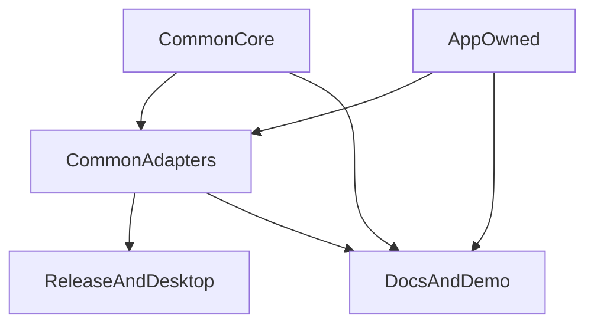

# RustWebAppCommon Architecture Design
> 更新时间: 2026-04-02 09:50 UTC

## 1. 文档目的
本设计稿将 research 结果转化为正式架构说明，供后续 starter repo、demo 页面设计和实现阶段复用。它回答三个核心问题：
1. `RustWebAppCommon` 的架构边界是什么。
2. 哪些能力属于 `common_core`，哪些属于 adapter，哪些必须留在应用层。
3. 后续实现前还必须验证什么。

## 2. 架构总览
`RustWebAppCommon` 采用三层结构：
- `common_core`: 共享协议、术语、配置、路由、docs schema、theme token、release metadata。
- `common_adapters`: 绑定具体运行面与 host/tooling 的适配层。
- `app_owned`: 各应用保留的页面、业务逻辑、路由、内容与 showcase。



## 3. 分层边界
### `common_core`
负责：
- `WorkspaceIdentity`
- `SurfaceKind`
- `DevLaunchRequest`
- `RouteDescriptor`
- `DocsNode`
- `ThemeTokenSet`
- `ReleaseDescriptor`

不负责：
- UI runtime 选择
- 具体 host 行为
- updater 实现
- 页面内容与业务逻辑

### `common_adapters`
负责：
- 把 core 契约映射到 web、docs、desktop、release 等运行面
- 处理 host/runtime/tooling 的差异
- 承接 adapter-local 的 SSH config 读取与 readonly remote doc/design 审阅

不负责：
- 重新定义 core 术语
- 吞掉应用层内容
- 把工具细节回写到 core 协议

### `app_owned`
负责：
- 页面组件
- 业务路由
- 业务数据与交互
- demo story / showcase 内容

## 4. Core Contracts 摘要
| 契约 | 用途 | 设计要求 |
|---|---|---|
| `WorkspaceIdentity` | 描述一个接入仓库的身份 | 稳定、可持久化 |
| `SurfaceKind` | 描述运行面 | 与工具无关 |
| `DevLaunchRequest` | 描述本地启动请求 | 支持 `host` / `port` / route entry |
| `RouteDescriptor` | 描述页面路径与层级 | 不绑定具体框架语法 |
| `DocsNode` | 描述 docs/index 入口 | 支持 human / main-agent / subagent |
| `ThemeTokenSet` | 描述视觉语法 | docs/demo 共享 |
| `ReleaseDescriptor` | 描述发布元信息 | 不绑定具体 CI |

详细定义见 `13_common_core_contracts.md`。

## 5. Adapter Boundaries 摘要
| adapter | 角色 | 主要依赖 |
|---|---|---|
| `web_demo_adapter` | web/demo 启动与静态产物 | `DevLaunchRequest`、`RouteDescriptor`、`ThemeTokenSet` |
| `docs_site_adapter` | docs/index 站点构建 | `DocsNode`、`ThemeTokenSet` |
| `desktop_tauri_adapter` | 桌面壳层与 bundle/update 接口 | `WorkspaceIdentity`、`ReleaseDescriptor` |
| `release_pipeline_adapter` | release/signing/CI 对接 | `ReleaseDescriptor`、`WorkspaceIdentity` |
| `remote_docs_review_adapter` | 本机 SSH config 读取、host alias 归一化与只读 remote review | 无；SSH/provider 细节停留在 adapter-local |

详细矩阵见 `14_adapter_boundary_matrix.md`。

## 6. 文档与 demo IA
文档与 demo 必须被视为架构的一部分，而不是附属输出：
- `README.md` 负责第一入口
- `AGENTS.md` 负责 agent 契约
- `docs/index.md` 负责系统导航
- `examples/README.md` 负责样例入口
- `demo/storyboard.md` 负责页面地图与展示逻辑

详细设计见 `15_docs_demo_information_architecture.md`。

## 7. 运行面策略
### web/demo
- 采用 `web_demo_adapter`
- 统一 `host` / `port` 协议
- 默认 web runtime 为“生成后的静态站点 + adapter 内部 HTTP shell”
- 静态产物应能映射到 GitHub Pages，并通过 `index.html + 404.html` 支持 nested route fallback

### docs
- 采用 `docs_site_adapter`
- 保持 docs/index 与 agent 入口对齐

### desktop
- 采用 `desktop_tauri_adapter`
- 当前默认预览实现为 browser-backed preview
- 默认验证路径为 `/detail/desktop-preview`
- 不把桌面能力作为所有应用默认前提

### release
- 采用 `release_pipeline_adapter`
- release metadata 进 core，具体 CI/provider 留在 adapter
- build / install / update / workflow 共享 `rustwebappcommon-<platform>` 与 `SHA256SUMS` 资产契约

### readonly remote review
- 采用 `remote_docs_review_adapter`
- `common review` 读取本机 `~/.ssh/config` 或 `--config` 覆盖路径
- 默认自动发现 `doc/`、`docs/`、`design/`、`designs/`，也支持显式 `--path`
- 只输出 host catalog、目录状态与文件摘要，不把 SSH provider、session 或 remote path state 写回 `common_core`

## 8. Failure Modes
- **Core 泄漏 host/tooling 细节**：导致 future adapter 无法替换。
- **Adapter 反向定义术语**：导致 docs/demo/core 各说各话。
- **App 内容进入 common**：导致多仓复用性下降。
- **docs 与 demo 双轨分裂**：导致 agent 入口碎片化。
- **SSH/provider 语义回写到 core**：导致 readonly review seam 与下游产品边界失真。
- **在无 starter repo 情况下固化实现**：导致设计稿过度抽象或过早绑定。

## 9. 立即可执行与延后验证
### 可立即执行
- 统一分层模型
- 统一 core contracts
- 统一 docs/demo IA
- 统一 theme token 与 CLI vocabulary

### 必须延后验证
- 原生 desktop shell 是否需要替换当前 browser-backed preview
- `doc_auto` 自动同步
- 更深的多平台构建/签名细节

## 10. Appendix A: CLI Vocabulary
| 命令 | 语义 |
|---|---|
| `common dev --surface web` | 启动 web/demo 运行面 |
| `common dev --surface desktop` | 启动 desktop 运行面 |
| `common demo` | 生成静态 demo/storyboard 产物 |
| `common docs` | 生成 docs/index 站点 |
| `common review` | 列出 SSH host 或执行只读 remote doc/design 审阅 |
| `common release` | 准备 desktop release 产物 |

## 11. Appendix B: Directory Model
```text
common/
  core/
  adapters/
  cli/
docs/
examples/
demo/
apps/
```

## 12. Appendix C: Demo Page Map
- `/`
- `/runtime`
- `/docs-entry`
- `/release-flow`
- `/style-lab`
- `/detail/:topic`

## 13. Appendix D: Theme Token Summary
- `bg.canvas`
- `bg.panel`
- `fg.primary`
- `fg.secondary`
- `line.strong`
- `line.soft`
- `accent.signal`

## 14. 设计结论
`RustWebAppCommon` 的最优架构不是单一框架，而是一套稳定的 core contracts 加一组可替换 adapters，再让应用层自由拥有页面与故事内容。这样才能同时支持统一能力、多仓复用和后续演进。
